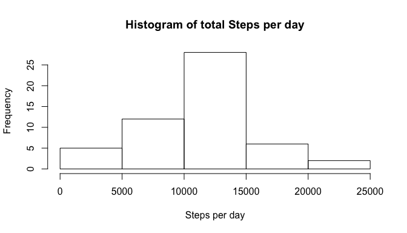
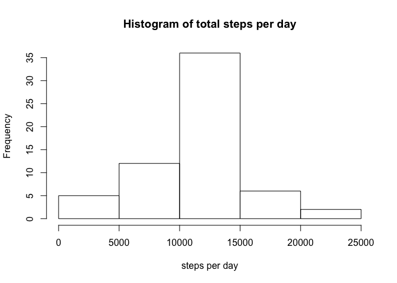
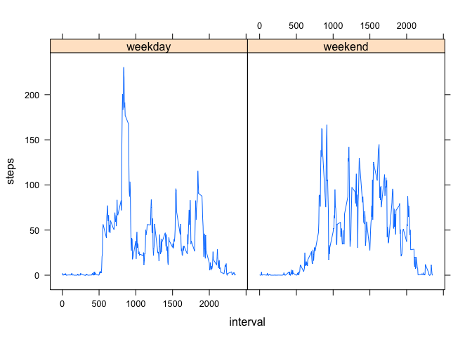

# Reproducible Research: Peer Assessment 1


## Loading and preprocessing the data
1.Loading the Data  

```r
library(dplyr)  
```

```
## 
## Attaching package: 'dplyr'
```

```
## The following objects are masked from 'package:stats':
## 
##     filter, lag
```

```
## The following objects are masked from 'package:base':
## 
##     intersect, setdiff, setequal, union
```

```r
library(lattice)  
activity_data<-read.csv("./activity.csv")  
```
2.Preprocessing the data  

```r
activity_data<-transform(activity_data, date = as.Date(date, format="%Y-%m-%d"))  
```

## What is mean total number of steps taken per day?
1.Calculate the total number of steps taken per day

```r
sum.by.day <- activity_data %>% 
              filter(!is.na(steps)) %>% 
              group_by( date) %>%
              summarize(steps=sum(steps, na.rm=TRUE))
```
2.Make a histogram of the total number of steps taken each day    

```r
hist(sum.by.day$steps, xlab="Steps per day", main="Histogram of total Steps per day")    
```


  
3.Calculate and report the mean and median of the total number of steps taken per day    
Mean

```r
as.integer(mean(sum.by.day$steps))
```

```
## [1] 10766
```
Median

```r
as.integer(median(sum.by.day$steps))
```

```
## [1] 10765
```

## What is the average daily activity pattern?

1.Make a time series plot (i.e.type = "l") of the 5-minute interval (x-axis) and the average number of steps taken, averaged across all days (y-axis)


```r
interval.avg.days <- activity_data %>% 
            filter(!is.na(steps)) %>% 
            group_by(interval) %>%
            summarize(mean.steps = mean(steps))
```
Plot

```r
plot(interval.avg.days$interval, interval.avg.days$mean, type="l", xlab = "Interval", ylab = "Steps")
```


2.Which 5-minute interval, on average across all the days in the dataset, contains the maximum number of steps?

```r
subset(interval.avg.days, mean.steps==max(mean.steps))
```

```
## Source: local data frame [1 x 2]
## 
##   interval mean.steps
##      (int)      (dbl)
## 1      835   206.1698
```
The interval 835, on average has maximum number of steps, with 206 steps.  

## Imputing missing values
1.Calculate and report the total number of missing values in the dataset (i.e. the total number of rows with 
NAs)

```r
na_count <- sum(is.na(activity_data$steps))
na_count
```

```
## [1] 2304
```

2.Devise a strategy for filling in all of the missing values in the dataset. 

3.Create a new dataset that is equal to the original dataset but with the missing data filled in.

Fill in a missing NA with the average number of steps in the same 5-min interval

```r
data_full <- activity_data
nas <- is.na(data_full$steps)
avg_interval <- tapply(data_full$steps, data_full$interval, mean, na.rm=TRUE, simplify=TRUE)
data_full$steps[nas] <- avg_interval[as.character(data_full$interval[nas])]
```
4.Make a histogram of the total number of steps taken each day  

```r
sum.by.day <- data_full %>% 
              group_by( date) %>%
              summarize(steps=sum(steps))
```


```r
hist(sum.by.day$steps, xlab="steps per day", main = "Histogram of total steps per day")
```



Calculate and report the mean and median total number of steps taken per day

Mean

```r
mean(sum.by.day$steps)
```

```
## [1] 10766.19
```
Median

```r
median(sum.by.day$steps)
```

```
## [1] 10766.19
```

## Are there differences in activity patterns between weekdays and weekends?

1.Create a new factor variable in the dataset with two levels – “weekday” and “weekend” indicating whether a given date is a weekday or weekend day.

```r
data_full <- mutate(data_full, weektype = ifelse(weekdays(data_full$date) == "Saturday" | weekdays(data_full$date) == "Sunday", "weekend", "weekday"))
data_full$weektype <- as.factor(data_full$weektype)
head(data_full)
```

```
##       steps       date interval weektype
## 1 1.7169811 2012-10-01        0  weekday
## 2 0.3396226 2012-10-01        5  weekday
## 3 0.1320755 2012-10-01       10  weekday
## 4 0.1509434 2012-10-01       15  weekday
## 5 0.0754717 2012-10-01       20  weekday
## 6 2.0943396 2012-10-01       25  weekday
```
Make a panel plot containing a time series plot  of the 5-minute interval (x-axis) and the average number of steps taken, averaged across all weekday days or weekend days (y-axis).

```r
average_data <- data_full %>%
                group_by(weektype, interval) %>%
                summarise(steps = mean(steps))
```


```r
library(lattice)
xyplot(steps~ interval | weektype, average_data, type="l")
```



